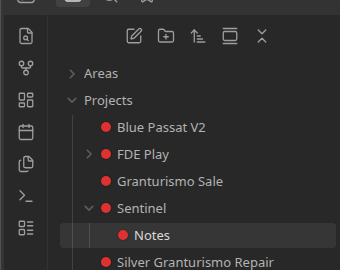

# Status Sets

📖 **[Full documentation](https://danrfletcher.github.io/obsidian-file-folder-status-icons/)**

Reusable status sets — think ClickUp's status pills — applied to files and
folders in Obsidian's file tree as traffic-light style icons.



## Features

- **Status dots in the file tree.** Any file or folder can show a small
  colored status icon next to its name, right in the native file explorer.
- **Custom statuses, custom colors.** Define your own statuses (label +
  color) grouped into reusable **status sets** in Settings.
- **Per-folder status sets and defaults.** Right-click any folder → *File
  and Folder Status Options* → *Enable statuses for this folder*, pick a
  status set, and every item in that folder is assigned its default status.
  You can also assign folders directly from Settings.
- **Click a dot to change it.** Click any status icon to open a small
  popup, with a curated pastel color palette plus a fully custom color
  picker, and re-assign that file or folder's status.
- **Group by status.** Enabled folders automatically sort their contents by
  status, and that order persists across restarts — even if a folder
  relying on an ancestor's settings gets moved elsewhere.
- **Completed and cancelled statuses.** Mark any status "completed" or
  "cancelled" (a status is one or the other, not both) and hide items in
  either state from the tree per folder, toggleable from Settings or a
  right-click.
- **Apply to files or folders independently.** Each folder assignment has
  separate **Files** / **Folders** toggles (both on by default) — turn
  either off and that type sorts alphabetically below the other, instead of
  taking part in the status grouping.
- **Truncate large groups.** Collapse 2+ items sharing a status into one
  summary row (e.g. "3 Ideas"), with an optional custom label. Click the row
  to expand it, double-click any status dot in the expanded group to
  collapse it again.
- **Glow.** An optional neon glow around status dots in the file tree,
  toggleable from Settings → Design. The dot itself never changes size.
- **Nothing touches your notes.** All assignments live in the plugin's own
  data file — no frontmatter is ever written. The plugin itself never makes
  network requests in the background — the only network activity it can ever
  trigger is opening your browser to a GitHub or Buy Me a Coffee page, and
  only when you click one of the buttons in Settings → Support to do exactly
  that. It does read your vault's list of folder paths (never file contents)
  to power the "Assign a folder" autocomplete.

## Usage

1. Open **Settings → Status Sets** and create a status set (e.g. "Not
   started" / "In progress" / "Done") with a color for each.
2. Right-click a folder in the file explorer → **File and Folder Status
   Options** → **Enable statuses for this folder** → pick the status set and
   a default status.
3. Click any status dot in the tree to change that item's status.
4. Right-click an enabled folder again (same submenu) to change its default
   status or turn statuses off (existing assignments are kept, so
   re-enabling restores them).

## Installation

### From Obsidian

Settings → Community plugins → Browse → search "Status Sets" → Install →
Enable.

### Manually

Copy `main.js`, `manifest.json`, and `styles.css` from a
[release](https://github.com/danrfletcher/obsidian-file-folder-status-icons/releases)
into `<your-vault>/.obsidian/plugins/file-folder-status-icons/`, then
enable the plugin from Community plugins.

## Development

```bash
npm install
npm run dev     # watch build
npm run build   # typecheck + production build
npm run lint
```

## License

MIT
