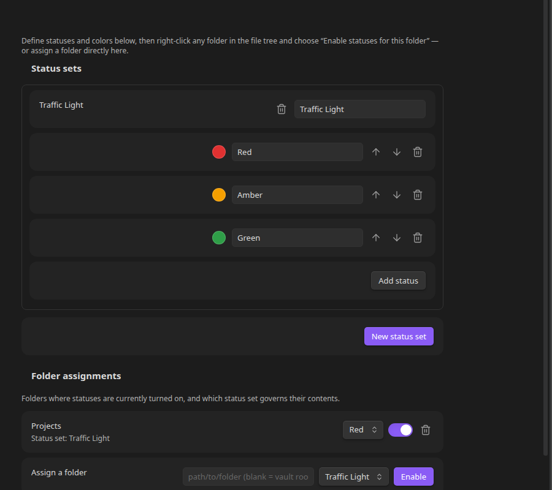
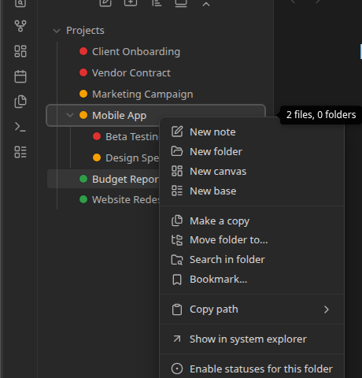
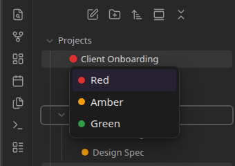

# Your First Status Set

This walks through setting up a classic Red / Amber / Green status set and turning it on for a folder, start to finish.

## 1. Create a status set

Open **Settings → Status Sets** and click **New status set**. Give it a name — "Traffic Light" works well for a general-purpose set.

Click **Add status** three times and set each one up:

| Label | Color |
|---|---|
| Red | a red |
| Amber | an amber/orange |
| Green | a green |

The order you put them in matters — it's also the sort order used when a folder groups its contents by status, so put your "not started" state first and your "done" state last.

## 2. Turn it on for a folder

Right-click any folder in the file tree — say, a `Projects` folder — and choose **Enable statuses for this folder**.

Pick the status set you just created, then pick a **default status** — the one every item in the folder starts out with. Every file and subfolder directly inside `Projects` now shows a colored dot.

## 3. Change a status

Click any dot to open a small popup listing every status in that folder's status set. Pick one, and the dot updates immediately — the item also moves to sit alongside everything else with the same status, since the folder groups by status automatically.

## 4. Turning it off (and back on)

Right-click the folder again and choose **Disable statuses for this folder** to turn the dots off. Your assignments aren't lost — re-enable it later and everything comes back exactly as you left it.

## Next

- Want more than one status set, or statuses scoped to specific folders? See [Status Sets and Colors](../reference/status-sets.md).
- Curious what happens with nested folders? See [Assigning Folders and Defaults](../reference/folders.md).
