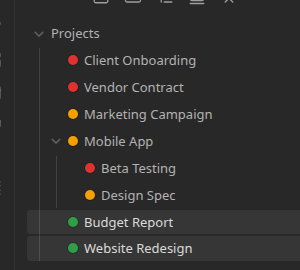

# Overview

**File and Folder Status Icons** brings ClickUp-style statuses to your Obsidian file tree. Define statuses like *Not Started*, *In Progress*, and *Done* — each with its own color — and assign them to files and folders right in the sidebar. No more guessing what's finished just from a filename.

Turn it on for a folder, and every item inside gets a colored dot next to its name. Click a dot to change its status. The folder's contents automatically group by status and stay that way — reopen the vault tomorrow and the order is exactly how you left it.

## What you could use it for

- A `Projects` folder where a glance at the sidebar tells you what's blocked, what's in flight, and what's shipped — no opening files required.
- A content pipeline folder with *Draft*, *In Review*, and *Published* statuses, so the file tree itself is the workflow board.
- A reading list or research folder with *To Read*, *Reading*, and *Done* — color-coded without touching a single note's frontmatter.
- Different status sets for different areas of your vault — a client folder tracked as *Red / Amber / Green*, a personal task folder tracked as *Todo / Doing / Done*.

## How it works

1. Define one or more **status sets** in Settings — each is a named list of statuses, in order, each with a label and a color.
2. Right-click any folder in the file tree and choose **Enable statuses for this folder**, pick a status set, and choose the default status new items should start with.
3. Every direct child of that folder gets a colored dot. Click a dot to reassign that file or folder's status via a small popup.
4. The folder's contents sort and group by status automatically, and the grouping persists across restarts — it's saved in the plugin's own data, not in your notes.

Nothing here touches your notes' content or frontmatter. Statuses live entirely in the plugin's own data file, keyed by file path.

## Where to go next

- New to the plugin? Start with [Installation](getting-started/installation.md) and [Your First Status Set](getting-started/first-status-set.md).
- Want the full picture on statuses and colors? See [Status Sets and Colors](reference/status-sets.md).
- Curious how a folder's default status and inheritance work? See [Assigning Folders and Defaults](reference/folders.md).
- Something not behaving as expected? Check the [FAQ and Troubleshooting](faq.md).
