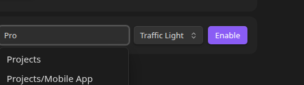

# Assigning Folders and Defaults

Statuses are turned on **per folder**, not globally. A folder that's "enabled" governs the statuses shown for its direct children — the files and subfolders sitting immediately inside it.

## Two ways to enable a folder

- **Right-click the folder** in the file tree → **File and Folder Status Options** → **Enable statuses for this folder** → pick a status set. Every item starts at that set's [default status](status-sets.md#default-status) — there's no separate "pick a default" step.
- **From Settings**, under **Folder assignments**, use the **Assign a folder** row: start typing a folder path and pick one from the live suggestions (or leave it blank for the vault root), pick a status set, and click **Enable**.

Either way, every direct child that doesn't already have a status of its own gets assigned the status set's default. Items that already had a status (from a previous enable/disable cycle) keep it.

## Changing the default later

Right-click an already-enabled folder and choose **File and Folder Status Options** → **Change default status for this folder**. This only affects items that get a status assigned *from now on*; it doesn't retroactively change existing items.

## Switching a folder's status set

The dropdown next to a folder in the **Folder assignments** list (Settings) switches which status set governs it, without needing to disable and re-enable the folder. The folder's default status resets to the new set's own default. Existing items keep their status if the new set happens to have a status with the same id (e.g. switching back and forth between two sets); otherwise they fall back to the new default the next time they're displayed.

## Disabling a folder

Right-click an enabled folder and choose **File and Folder Status Options** → **Disable statuses for this folder**. The dots disappear, but nothing is deleted — every item's assignment is preserved, so re-enabling the folder (even with a different status set) restores exactly where you left off if you switch back.

## Hiding completed and cancelled items

Each folder assignment has its own **Hide** row with separate **Completed** and **Cancelled** toggles — turn either on and any item whose current status is marked [completed or cancelled](status-sets.md#completed-statuses) disappears from the tree entirely (it's still there, just not shown in the sidebar). Toggle them from the **Folder assignments** list in Settings, or right-click an enabled folder and choose **File and Folder Status Options** → **Hide/Show completed items** or **Hide/Show cancelled items**.

## Applying statuses to files vs. folders

Each folder assignment has two independent toggles, **Files** and **Folders**, both on by default. Turn either off and that type stops showing status dots (and stops being sorted by status) under this folder — it's still there, just plain and alphabetical, sitting below whichever type is still status-driven. See [Sorting and Grouping](sorting.md#files-and-folders-separately) for exactly how that reorders the tree.

This is useful when statuses only make sense for one type — e.g. a "project stage" status set that should color folders but leave the individual files inside them alone, or a note-status set that shouldn't apply to subfolders at all.

## Truncating large groups

A folder assignment can collapse a status into a single summary row once **2 or more** of its direct children share it — e.g. three items with status "Idea" become one row reading **"3 Ideas"**. Turn it on per status, per folder assignment, under the **Truncate statuses** section of **Folder assignments** in Settings.

By default the summary text is the status's own label, pluralized (`Idea` → `Ideas`). The text field next to the toggle lets you override that with anything you like — e.g. `Project Ideas` instead of the default `Ideas` — the count is always prefixed automatically.

**Opening and closing a group:**

- Click the summary row (its dot or its text) to expand it back into the individual items, sorted in their normal position.
- Double-click any item's status dot while its group is expanded to collapse it again.

Truncation is evaluated per folder — the same status can be truncated in one folder and shown in full in another, and it only ever groups a folder's own direct children, never items from subfolders.

## Nested folders and inheritance

A subfolder with no status configuration of its own **inherits** its nearest enabled ancestor's status set — so enabling `Projects` also puts dots on files inside `Projects/Mobile App` even though `Mobile App` was never explicitly enabled itself.

This inheritance is a per-folder toggle (the labeled **Inherit to subfolders** switch in **Folder assignments**), so you can turn it off for a specific folder if you don't want its configuration to cascade down to subfolders.

A subfolder *can* have its own explicit configuration — different status set, different default — which takes over for its own children, while the subfolder itself (as an item inside its parent) still shows whatever status its parent's configuration gives it.

**Moving an inheriting subfolder is safe.** If you drag or move a subfolder that was only ever inheriting (no config of its own) out from under its enabled ancestor, the plugin snapshots what it was inheriting right before the move and gives the subfolder that same configuration as its own at its new location — so its statuses keep working instead of silently disappearing just because it's no longer under the folder it used to inherit from.

## What actually gets stored

Nothing is written to your notes. Every status set, folder assignment, and per-item status lives in the plugin's own data file (`data.json` inside the plugin folder), keyed by vault-relative path. Renaming or moving a file updates its stored path automatically, so a status assignment survives a rename.
