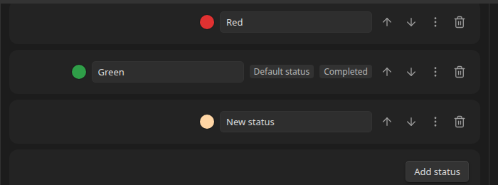
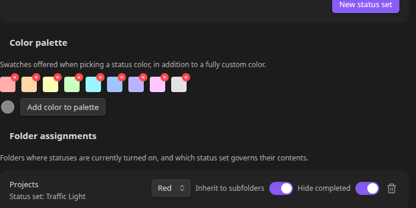

# Settings Reference

Everything lives under **Settings → File and Folder Status Icons**.

## Status sets

- Each status set starts **collapsed**, showing just its name and status count — click the **chevron** to expand it.
- **New status set** — creates an empty (collapsed) status set; expand it and give it a name in the text field next to its heading.
- Each status row has a **color swatch** (click to open the color picker), a **label** text field, **up/down** arrows to reorder it within the set, and a **"..."** menu.
- The **"..."** menu offers **Make default** and **Mark/Unmark as completed status**. The current default shows a **Default status** badge; completed statuses show a **Completed** badge.
- **Add status** — appends a new status (defaults to a plain gray) to the set. It's usable immediately everywhere the set is already assigned — no need to reopen or restart.
- The **trash icon** next to a status removes it; next to a status set's name, it deletes the whole set and disables statuses for any folder that was using it.

See [Status Sets and Colors](reference/status-sets.md) for the full behavior.

## Color palette

A row of swatches offered whenever you pick a status color, in addition to a fully custom color. Each swatch (including the built-in defaults) has a small remove button. **Add color to palette** opens a native color picker to add a new one.

## Design

- **Glow** — adds an optional neon glow around status dots in the file tree, colored to match each dot's status. Purely cosmetic: the dot itself stays exactly the same size, so it never grows taller than the text next to it.

## Folder assignments

Lists every folder that currently has statuses turned on:

- The folder's **path** (`/` for the vault root) and which **status set** governs it.
- A **dropdown** to switch which status set governs the folder. Switching resets the folder's default status to the new set's own default; to change the default *within* the current set instead, right-click the folder in the file tree and choose **Change default status for this folder**.
- **Inherit to subfolders** — a labeled toggle for whether its configuration is inherited by subfolders that don't have their own (on by default).
- **Hide completed** — a labeled toggle to hide items whose status is marked completed from the tree entirely.
- A **trash icon** to disable statuses for that folder (assignments are preserved, not deleted).

## Assign a folder

A quick way to enable statuses for a folder without leaving Settings or hunting for it in the file tree:

- **Path field** — start typing and pick a suggested vault folder path, or leave it blank for the vault root.
- **Status set dropdown** — which set to use.
- **Enable** — turns statuses on for that folder, using the status set's [default status](reference/status-sets.md#default-status).

See [Assigning Folders and Defaults](reference/folders.md) for everything this does under the hood.
